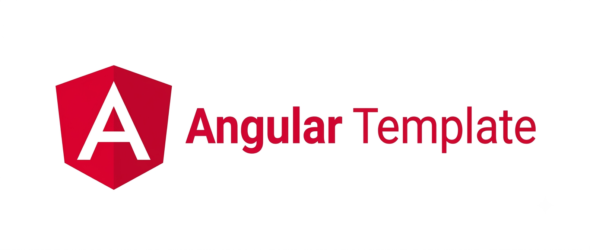

<p align="center">
  <a href="https://angular.dev"></a>
  <a href="https://www.typescriptlang.org"></a>
  <a href="https://jestjs.io"></a>
  <a href="https://playwright.dev"></a>
  <a href="https://github.com/features/actions"></a>
</p>

A minimal, well-structured, production-ready **Angular** frontend template, standalone
components, signal-based state, test-covered, and CI-ready out of the box.

> This is a custom template made by **AzyzHm**.

## Features

- **Angular 21** with **standalone components** end-to-end (no `NgModule`s)
- **Zoneless change detection**: no `zone.js` dependency, driven by signals, template events, and async-pipe emissions (Angular's default as of v21)
- **Signals** for local component state, no external state management library
- **Layered architecture**: `core` (services/guards/interceptors) → `shared` (reusable
  UI) → `features` (routed pages), plus a `layout` shell
- **SCSS** with shared design tokens (`src/styles/_variables.scss`, `_mixins.scss`)
- **Full test suite**: unit, integration, and e2e tests in separate folders, Jest +
  Testing Library for unit/integration, Playwright for e2e
- **GitHub Actions CI**: lint → unit/integration tests → build → e2e, on every push/PR
- **ESLint (flat config) + Prettier + Husky + lint-staged** pre-wired
- **HTTP interceptors** for auth token attachment and centralized error handling
- **Path aliases** (`@app`, `@core`, `@shared`, `@features`, `@env`) configured
  consistently across TypeScript, Angular, and Jest

## Project Structure

```
angular-custom-template/
├── .github/
│   ├── workflows/ci.yml        # CI: lint → test → build → e2e
│   ├── ISSUE_TEMPLATE/
│   └── pull_request_template.md
├── public/                     # Static assets served as-is (banner.png lives here)
├── src/
│   ├── app/
│   │   ├── core/                # Singleton services, guards, interceptors, models
│   │   │   ├── guards/
│   │   │   ├── interceptors/
│   │   │   ├── services/
│   │   │   └── models/
│   │   ├── shared/               # Reusable, presentation-only building blocks
│   │   │   ├── components/
│   │   │   ├── directives/
│   │   │   └── pipes/
│   │   ├── features/             # Routed feature pages (lazy-loaded)
│   │   │   └── home/
│   │   ├── layout/                # App shell (header/footer)
│   │   ├── app.component.ts
│   │   ├── app.config.ts         # Providers: router, HttpClient, interceptors
│   │   └── app.routes.ts
│   ├── environments/
│   ├── styles/                   # Shared SCSS variables and mixins
│   └── main.ts
├── tests/
│   ├── unit/                     # Isolated component/pipe/service tests
│   ├── integration/               # Real component trees, no collaborator mocking
│   └── e2e/                       # Full-browser user flows (Playwright)
├── scripts/                       # lint.sh, test.sh helper scripts
├── angular.json
├── jest.config.ts
├── playwright.config.ts
├── eslint.config.js
└── package.json
```

## Getting Started

### 1. Clone and install dependencies

```bash
git clone https://github.com/AzyzHm/Angular-Custom-Template.git
cd Angular-Custom-Template
npm install
npm run prepare   # sets up git hooks (husky)
```

### 2. Run the app

```bash
npm start
```

The app will be available at `http://localhost:4200`.

### 3. Configure environments

Edit `src/environments/environment.ts` (dev) and `src/environments/environment.prod.ts`
(prod) to point `apiBaseUrl` at your backend.

## Running Tests

Tests are split by type, matching the folder structure under `tests/`.

```bash
# All unit + integration tests
npm test

# By type
npm run test:unit
npm run test:integration

# With coverage (same as CI)
npm run test:coverage

# End-to-end (Playwright, spins up the dev server automatically)
npm run e2e
npm run e2e:ui   # interactive mode

# Everything at once (same as CI)
bash scripts/test.sh
```

## Linting & Formatting

```bash
npm run lint
npm run format:check

# or, matching CI exactly:
bash scripts/lint.sh
```

This runs ESLint (with Angular-specific rules) and a Prettier check, the same checks
enforced in CI. `lint-staged` also runs both automatically on staged files via a pre-commit
hook.

## Continuous Integration

Every push and pull request to `main` triggers `.github/workflows/ci.yml`, which:

1. Lints and format-checks the codebase
2. Runs unit + integration tests with coverage (uploaded as a build artifact)
3. Builds the production bundle (uploaded as a build artifact)
4. Runs the full Playwright e2e suite against the build

## Adding a New Feature

A typical new feature (e.g. `Products`) touches these layers:

1. `src/app/features/products/` — components + `products.routes.ts`
2. `src/app/core/services/` — an API service built on top of `ApiService`
3. `src/app/core/models/` — TypeScript interfaces for the feature's data
4. Register the lazy route in `src/app/app.routes.ts`
5. Add tests under `tests/unit`, `tests/integration`, and (if it's part of a bigger flow)
   `tests/e2e`

## Contributing

Contributions are welcome! Please read [CONTRIBUTING.md](CONTRIBUTING.md) for setup steps
and PR guidelines, and note that this project follows a
[Code of Conduct](CODE_OF_CONDUCT.md).

## Security

Found a vulnerability? Please see [SECURITY.md](SECURITY.md) for how to report it
responsibly.

## License

This project is licensed under the [MIT License](LICENSE).

---

Made with care by **AzyzHm**.
