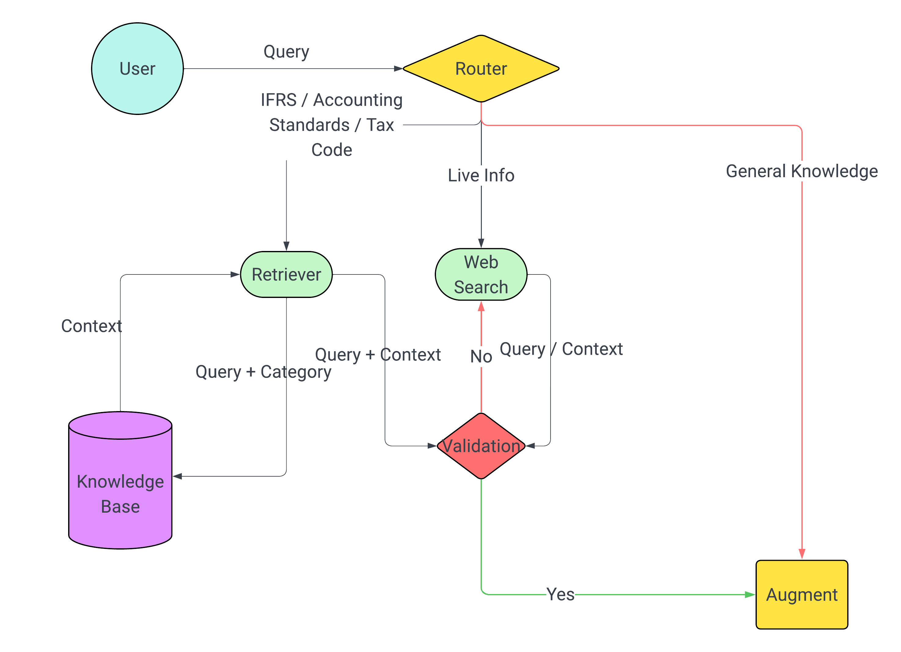

# AI Accounting Assistant

## 1. Project Objectif
This project aims to help professional people in tunisia find answers to their accounting questions by using the power of agentic rag.

---

## 2. Technologies Used

- **FastAPI**: Backend API framework for serving chat and retrieval endpoints.
- **Streamlit**: Frontend framework for building the interactive chat UI.
- **ChromaDB**: Vector database for storing and retrieving document embeddings.
- **Ollama**: Runs the local embedding model (`embeddinggemma`) for document and query embeddings.
- **Gemini API**: Accesses the `gemini-2.5-flash` LLM for answer generation and query routing.
- **Tavily API**: Provides web search capabilities to supplement local knowledge.

## 3. Architecture



---

## 4. Installation & Setup

### Getting Started :

1. First Setup a virtual environment and install dependencies using this command :
    ```powershell
    python -m venv venv
    pip install -r requirements.txt
    For notebook/experimentation work, also install:
    pip install -r requirements-dev.txt
    ```

2. Create a .env file to store env variables (APIs), it should look like this :

    ```env
    gemini_api_key=<api_key>
    tavily_api_key=<api_key>
    ```

### Running the app (local):

Make sure to run this command in the terminal before doing anything:
```powershell
$env:PYTHONPATH = "."
```

#### FrontEnd :
```powershell
streamlit run .\frontend\main.py
```

#### Backend :
```powershell
python -m uvicorn app.main:app --reload
```

---

## 5. Project Structure

```
AI-Accounting-Assistant/
│
├── app/                          # FastAPI backend (main API logic)
│   ├── main.py                   # API entrypoint
│   ├── config/
│   │   ├── models.py             # LLM and embedding model utilities
│   │   ├── api_keys.py           # Initializing Models API Keys
│   │   └── prompts.py            # Prompt templates for LLM
│   ├── graph/
│   │   ├── state.py              # Graph state definition
│   │   ├── workflow.py           # Orchestration logic for query pipeline
│   │   └── nodes/
│   │       ├── generate.py       # Node for generating answers
│   │       ├── router.py         # Node for routing nodes
│   │       ├── validate.py       # Node for validating context
│   │       ├── web_search.py     # Node for searching the web for context
│   │       └── retrieve.py       # Node for retrieving context from DB
│   ├── routes/
│   │   └── chat.py               # Chat API route
│   └── services/
│       ├── search_service.py     # Tavily Search Service
│       └── chroma_service.py     # ChromaDB collection/service
│
├── frontend/                     # Streamlit frontend (UI)
│   └── main.py
│
├── knowledge_base/               # Data processing and embedding
│   ├── documents/                # Raw PDF documents
│   ├── extracted_text/           # Extracted text from PDFs
│   ├── processed_chunks/         # Chunked and cleaned text
│   ├── chroma_db/                # ChromaDB persistent storage
│   ├── extract_text.py           # PDF text extraction
│   ├── preprocess.py             # Text cleaning & chunking
│   └── create_db.py              # Embedding & DB ingestion
│
├── assets/                          # Documentation assets
│   └── architecture.png
│
├── requirements.txt              # Python dependencies
├── .env                          # Environment variables (user-created)
└── readme.md                     # Project documentation
```
---

## 6. Core Concepts

- **Document Extraction**: PDF files are processed using [`knowledge_base/extract_text.py`](knowledge_base/extract_text.py) to extract raw text into `.txt` files.
- **Text Preprocessing**: Text files are cleaned and split into manageable chunks via [`knowledge_base/preprocess.py`](knowledge_base/preprocess.py), producing `.jsonl` files for each document.
- **Embedding & Database**: Chunks are embedded using a local model and stored in a persistent vector database (ChromaDB) via [`knowledge_base/create_db.py`](knowledge_base/create_db.py).
- **Backend API**: The FastAPI backend (`app/main.py`) receives user queries, retrieves relevant chunks from the vector DB, and generates answers using an LLM.
- **Frontend UI**: The Streamlit frontend (`frontend/main.py`) provides a chat interface for users to interact with the assistant.
- **Classification**: Each answer is categorized (e.g., IFRS, Tax_code...) for context-aware responses.

---

## 7. testing queries :
1. Under IFRS, what conditions must be met to recognize a provision, and how does this differ from contingent liabilities? (IFRS)

2. Comment est déterminé le résultat fiscal à partir du résultat comptable selon la législation tunisienne ? (Fiscalité tunisienne)

3. How does IFRS 15 allocate the transaction price in a contract with multiple performance obligations? (IFRS)

4. Comment la TVA est-elle traitée sur les exportations de biens et les services internationaux en Tunisie ? (Fiscalité tunisienne)

5. How should a USD-denominated trade receivable be remeasured at year-end under IAS 21? (IFRS / Foreign currency)

6. Une provision comptabilisée selon IAS 37 mais non déductible fiscalement en Tunisie : quel est l’impact en matière d’impôt différé ? (IFRS / Fiscalité tunisienne)

7. How does IFRS define control for the purpose of consolidating a subsidiary? (IFRS)

8. Quelles charges sont considérées comme non déductibles fiscalement en Tunisie ? (Fiscalité tunisienne)

9. What is the difference between a change in accounting policy and a change in accounting estimate under IFRS? (IFRS)

10. Une entreprise tunisienne facture en euros : comment les écarts de change sont-ils traités comptablement et fiscalement ? (IFRS / Fiscalité tunisienne)

11. How are financial assets classified and measured under IFRS 9? (IFRS)

12. Comment est calculé l’impôt sur les sociétés en Tunisie pour une société résidente ? (Fiscalité tunisienne)

13. What is the current EUR/TND exchange rate, and how would it affect the valuation of foreign currency balances? (Live exchange rates)

14. Une subvention d’investissement reçue par une entreprise tunisienne : traitement comptable IFRS et traitement fiscal ? (IFRS / Fiscalité tunisienne)

15. How does IFRS treat the subsequent measurement of investment property under IAS 40? (IFRS)

16. Comment sont traitées fiscalement les provisions pour risques et charges en Tunisie ? (Fiscalité tunisienne)

17. If the Tunisian dinar depreciates after the reporting date, is this an adjusting or non-adjusting event under IFRS? (IFRS / Events after reporting period)

18. Une facture fournisseur en devise est réglée après la clôture : quel est le traitement comptable selon IAS 21 ? (IFRS / Foreign currency)

19. How is VAT applied to imported goods in Tunisia? (Fiscalité tunisienne)

20. Under IFRS 16, how is a lease liability initially measured? (IFRS)

21. Une entreprise applique les IFRS mais est soumise à la loi fiscale tunisienne : que faire en cas de divergence entre les deux ? (IFRS / Fiscalité tunisienne)

22. How are deferred tax assets recognized under IAS 12, and what evidence is required? (IFRS)

23. Comment sont imposés les revenus de source étrangère pour une société tunisienne ? (Fiscalité tunisienne)

24. How do exchange rate fluctuations impact profit or loss under IFRS? (IFRS / Foreign currency)

25. Une entreprise tunisienne exportatrice réalise des ventes exonérées de TVA : quel est l’impact sur le droit à déduction ? (Fiscalité tunisienne)
